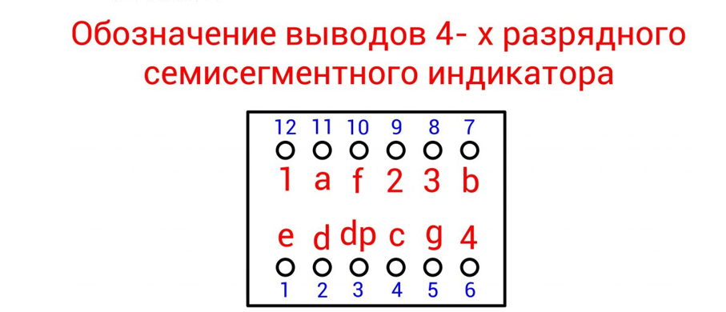
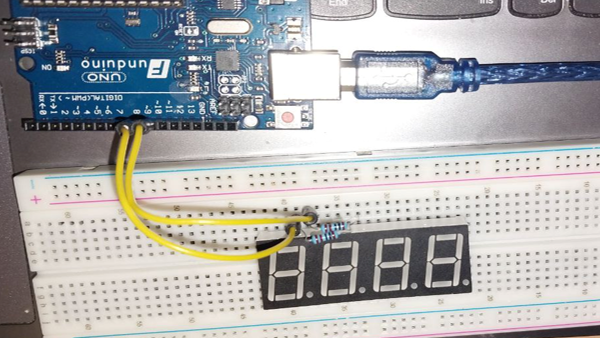

# Теоретическое введение

**Arduino** – это плата используемая для создания устройств способных взаимодействовать с окружающей средой и воспринимать различные данные из нее при помощи различных датчиков и управляющих устройств, таких как двигатели и т.д. Также это платформа с открытым исходным кодом, основанная на микроконтроллерах. Термин «открытый исходный код» означает, что все ресурсы платы, включая CAD файлы и т.д., находятся в свободном доступе для всех пользователей.
 Поэтому каждый может изменить их исходя из своих потребностей. Платы Arduino были разработаны для того, чтобы предоставить любому интересующемуся пользователю недорогой и легкий способ создания микроконтроллерных устройств, взаимодействующих с окружающей физической средой.
Следует выделить 2 сегмента:\
- Аппаратную часть – саму плату; \
- Программную часть – которая включает в себя Arduino IDE (простое и легкое в освоении программное обеспечение для написания программ Arduino).

Простота и легкость в освоении Arduino сделали данную платформу невероятно популярной по всему миру.

**Светодиодный семисегментный индикатор** представляет собой группу светодиодов, расположенных в определенном порядке и объединенных конструктивно. Светодиодные контакты промаркированы метками от a до g (и дополнительно dp – для отображения десятичной точки), и один общий вывод, который определяет тип подключения индикатора (схема с общим анодом ОА, или общим катодом ОК). Зажигая одновременно несколько светодиодов, можно формировать на индикаторе символы цифр.

**Матрица 4-разрядная** из семисегментных индикаторов состоит из четырех семисегментных индикаторов и предназначена для одновременного вывода на матрицу 4 цифр, также есть возможность вывода десятичной точки.
Для вывода цифры необходимо зажечь нужные светодиоды на контактах A–G и DP и выбрать нужную матрицу подачей LOW на вывод 6, 8, 9 или 12.

# Основная часть

Мы рассмотрим работу Arduino с 4-разрядной семисегментной матрицей. Получим представление о динамической индикации, позволяющей использовать одни выводы Arduino при выводе информации на несколько семисегментных индикаторов.

Необходимые компоненты: 
- контроллер Arduino UNO R3; 
- плата для прототипирования Breadboard; 
- 4-разрядная семисегментная матрица; 
- резистор 510 Ом – 8 штук; 
- кнопка; 
- резистор 10 кОм; 
- провода Male-Male (папа-папа).

Подключим контакты матрицы к плате Arduino и будем выводить цифры на различные разряды матрицы. Для подключения нам понадобятся 12 выводов Arduino. Мы будем подключать компоненты на breadbord следуя следующей схеме:

Соберем схему, параллельно подсматривая на схему выше.

Ножки подключения сегментов A и F  через резисторы поключаю к цифровым выходам D9 и D10 соответственно.

Ножки подключения разрядов индикатора 2 и 3 подключаю к цифровым выводам D11 и  D12 соответственно. Ножку подеключения сегмента B через резистор подключаю к цифровому выводу D13. 

Ножки подключения сегментов E, D, DP через резисторы подключаю к цифровым выводам D7, D6, D5 соответственно.

Ножку подключения  разряда 1 подключаю к цыфровому выводу D8. Ножки подключения сегментов С и G  через резисторы поключаю к цифровым выходам D4 и D3 соответственно. Ножку подключения  разряда 4 подключаю к цыфровому выводу D2.

Напишем скетч последовательного вывода цифр (0–9) на произвольный регистр матрицы. Для выбора случайного значения из диапазона будем использовать функцию random(). В массиве numbers[] хранятся значения, соответствующие данным для отображения цифр 0–9 (старший разряд байта соответствует метке сегмента A индикатора, а младший – сегменту G), в массиве pins[] – значения контактов для сегментов A–G и DP, в массиве pindigits[] – значения контактов для выбора разряда матрицы.

Запустив этот скетч, мы видим, что выводятся цифры от 1 до 9 в произвольных регистрах матрицы. Демонстрацию работы можно посмотреть [по ссылке](https://youtu.be/LRzbzr7O2bY).

Далее модифицируем нашу схему в секундомер, подключив к ней кнопку. 

Загружаем в плату Arduino следующий скетч:

Запустив скетч, мы видим, что при нажатии на кнопку у нас запускается секундомер, при обратном нажатии он прекращается.  Демонстрацию работы можно посмотреть [по ссылке](https://youtube.com/shorts/sWih8G_qtxo?feature=share).

# Вывод

В этом проекте мы познакомились с 4- разрядной семисегментной матрицей.  Также узнали о динамической индикации, позволяющей использовать одни выводы Arduino  при выводе информации на несколько семисегментных индикаторов. Получили как практические так и теоретические навыки по работе с четырехразрядным семисегментным индикатором.
